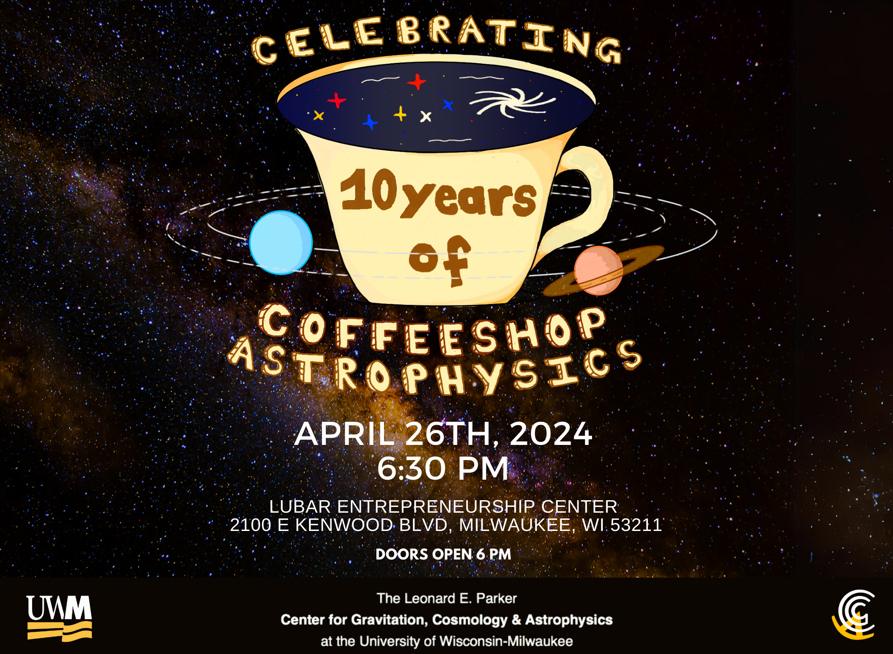
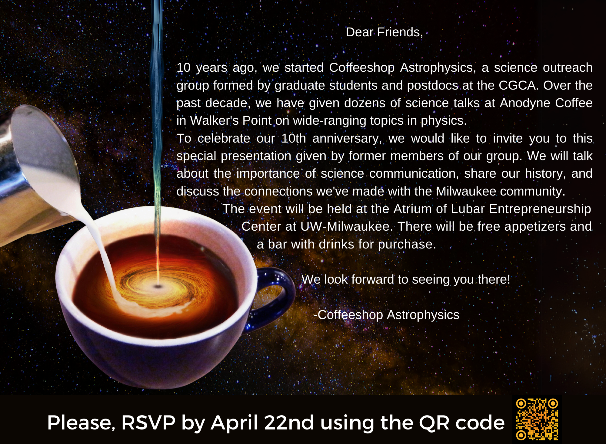

+++
title = 'Coffeeshop Astrophysics 10-Year Anniversary'
date = 2024-04-26T18:30:00-05:00
draft = false
+++

## Watch the recording on YouTube:


On Friday, April 26th, 2024, CoffeeShop Astrophysics celebrated its 10th anniversary at the Lubar Entrepreneurship Center. What began as a small student-run outreach effort has grown into a decade of connecting Milwaukee with the wonders of astrophysics. The event featured talks from former CSA members Sydney Chamberlain, Laleh Sadeghian, and Casey McGrath, who reflected on the group’s founding and its journey over the years. It was a night of stories, community, and celebration.

## Invitation Card

