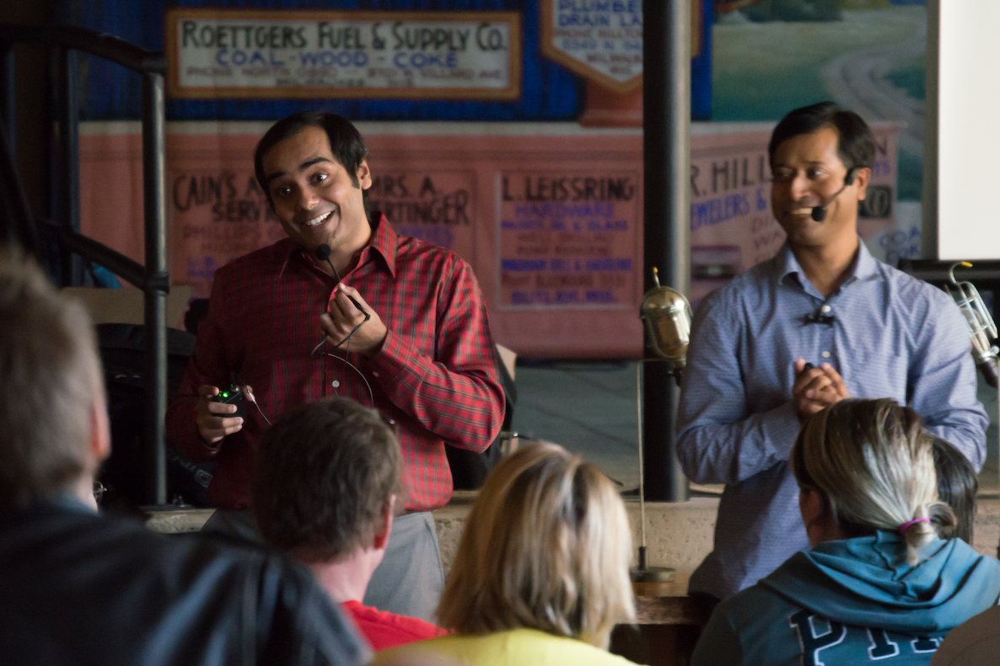
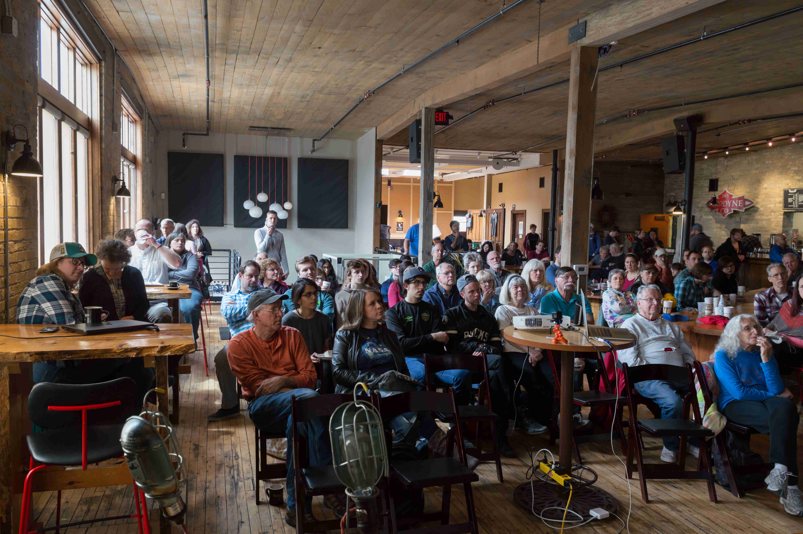
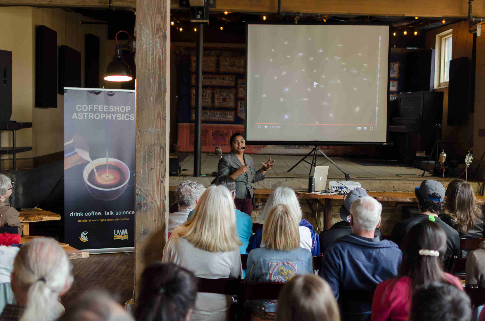
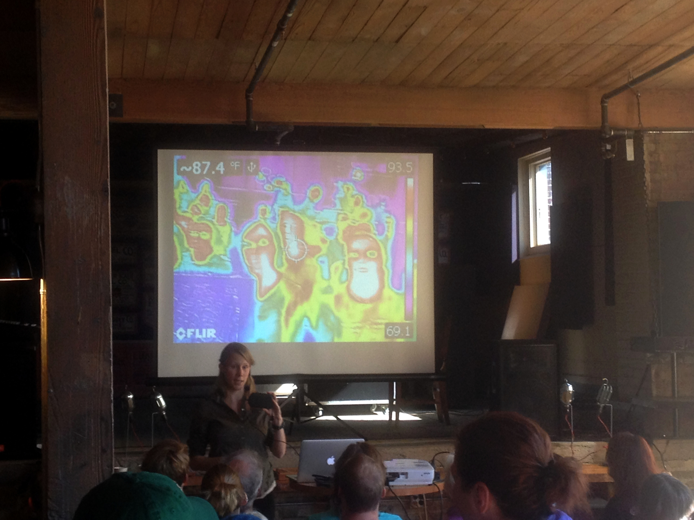
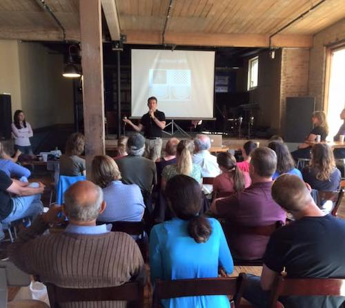
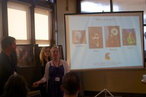
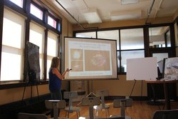

+++
title = 'Old Photos'
date = 2025-07-21T11:00:00-07:00
draft = false
tags = ['photos']
+++

Here is some collection of old photos migrated from our old website.

## Spring 2018

---

## 10/8/2016 - Light and Spectra: The Colors of our Universe
Playing with infrared cameras and diffraction grating glasses - what fun!

---

## 10/24/2015 - 100 Years of Einstein's Theory of General Relativity

---

## 9/19/2015 - From Neurons to Thoughts: A Guided Tour of the Brain, by Guest Speaker Dr. Leonardo Fernandini

---

## 8/29/2015 - The Dark Side of the Universe: The Mysteries of Dark Matter and Dark Energy

---

## 7/25/2015 - New Horizons mission to Pluto

---

## 10/11/2014 - The black hole that ate my sock: strange facts about these and other dead stars

---

## 09/27/2014 - Live fast, die young: the lifecycle of stars

---

## 09/06/2014 - The Big Bang

